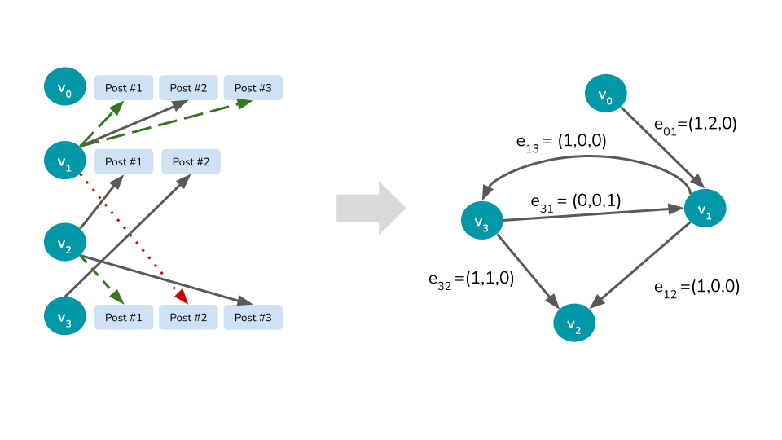
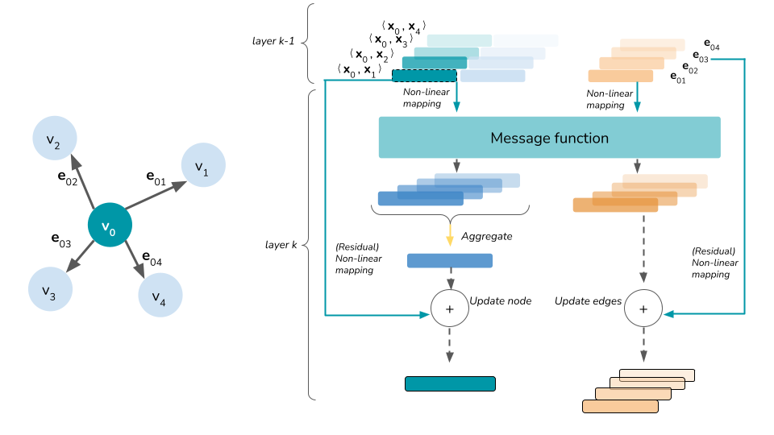
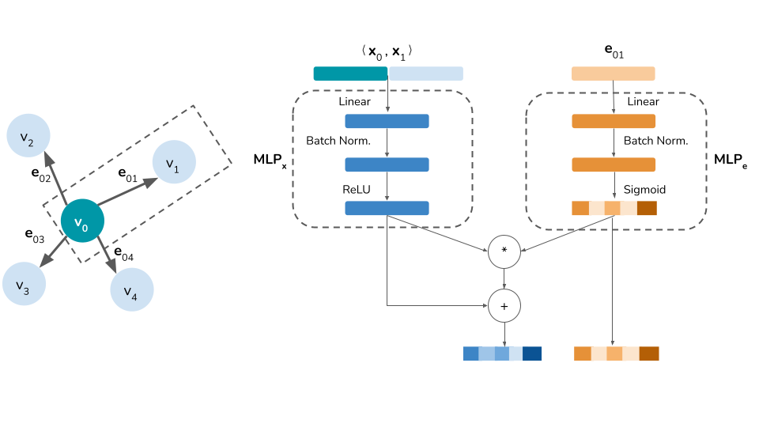
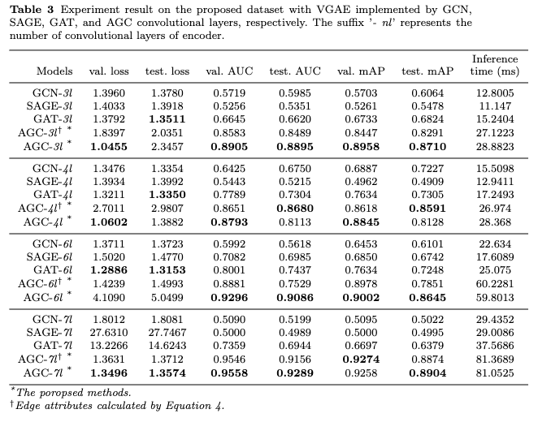

# Amplification Factor Score
This is the summary of experiment on detecting and measuring influencer on Social Media Network.

The original paper is [Measuring the influence and amplification of users on social network with unsupervised behaviors learning and efficient interaction-based knowledge graph](https://link.springer.com/article/10.1007/s10878-021-00815-0)

## Overview
To identify and measure the influence, users are represented as knowledge graph structure based on their behaviors on social media network. An **Amplified Graph Convolution (AGC)** is proposed to learn the representation. Our approach has advatanges:
* No labelling effort: by leveraging Variational Graph Auto-encoder (VGAE)
* Dealing with multi-dimensional edge attributes with AGC
* Outperform popular GNN such as Graph Convolution Network (GCN), GraphSAGE, Graph Attention Network (GAT)

## Approach
### Construct knowledge graph

### Amplified Graph Convolution (AGC)

Follow the Message Passing mechanism

The detail of message function is illustrated as

## Experimental results
### Benchmark
$9225$ users on Facebook are collected, each user is a vertex contains information about
* total followers
* total friends
* gender
* the number of books
* films
* music
* post fame
* active score

The connection between two users are determined by multi-dimensional attributes:
* number of reactions
* number of comments
* number of shares

The final knowledge graph contains $9225$ nodes and $24901$ nodes

For other Graph Convolution Networks that are unable to handle multi-dimensional edge attribuets, edges are weighted sum as a scalar

### Visualization of representation

Each user is denoted as a circle. We apply DBSCAN to cluster the users. 

* **The size of node is proportional to the value of AF score**: each node is assigned its own AF score, node with higher score is approximately bigger.  

* **Nodes closed together are likely to be similar**: this similarity due to that, for example, maybe they are both concerned about the same topics, or they have similar interests, etc. Since embeddings are very abstract, we do not know the exact reason. However, these high-level embeddings are able to automatically explore the hidden information that can not be seen in original data thanks to our powerful model.  

* **Nodes themselves are clustered into the specific sub-community**: based on the similarity, our model can automatically cluster all nodes into many sub-communities by their behaviors. Each sub-community has its own coverage and top influencers calculated by AF score. It helps to monitor and identify who has most influence in their community.  
